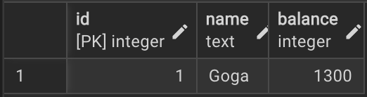

# Отчёт: Аномалии изоляции транзакций в PostgreSQL

## Рассмотренные аномалии

| #   | Аномалия                                   | Уровень, при котором возникает |
| --- | ------------------------------------------ | ------------------------------ |
| 1   | Dirty Read (грязное чтение)                | READ UNCOMMITTED               |
| 2   | Non-Repeatable Read (неповторяемое чтение) | READ COMMITTED                 |
| 3   | Phantom Read (фантомное чтение)            | READ COMMITTED                 |
| 4   | Lost Update (потерянное обновление)        | READ COMMITTED                 |

---

## Подготовка: таблицы и тестовые данные

```sql
CREATE TABLE accounts (
    id      SERIAL PRIMARY KEY,
    name    TEXT NOT NULL,
    balance INTEGER NOT NULL
);

CREATE TABLE orders (
    id     SERIAL PRIMARY KEY,
    amount INTEGER NOT NULL
);

INSERT INTO accounts (name, balance) VALUES ('Alice', 1000);
INSERT INTO orders (amount) VALUES (50), (150), (200);
```

Таблица `accounts` используется для аномалий 1, 2 и 4.  
Таблица `orders` — для аномалии 3.

---

## Dirty Read (грязное чтение)

### Описание

Транзакция T2 читает данные, изменённые транзакцией T1, которая ещё **не зафиксирована**. Если T1 откатится, T2 прочитает данные, которых никогда не существовало.

### Шаги воспроизведения

| Шаг | T1                                                                     | T2                                                  |
| --- | ---------------------------------------------------------------------- | --------------------------------------------------- |
| 1   | `BEGIN` (READ COMMITTED)                                               |                                                     |
| 2   | `UPDATE accounts SET balance = 9999 WHERE id = 1` *(не зафиксировано)* |                                                     |
| 3   |                                                                        | `BEGIN` (READ UNCOMMITTED)                          |
| 4   |                                                                        | `SELECT balance FROM accounts WHERE id = 1` → **?** |
| 5   | `ROLLBACK`                                                             |                                                     |

### Результат

```
[T1] UPDATE balance → 9999  (not committed yet)
[T2] READ balance = 1000  (isolation: READ UNCOMMITTED)

PREVENTED: T2 read 1000 (committed value), not 9999 (T1's dirty write).
           PostgreSQL silently upgrades READ UNCOMMITTED → READ COMMITTED,
           making dirty reads impossible.
FIX: Use READ COMMITTED or higher (PostgreSQL default).
```

> **Примечание.** PostgreSQL не реализует уровень READ UNCOMMITTED в полном смысле —
> он автоматически повышает его до READ COMMITTED. Поэтому грязное чтение
> в PostgreSQL **невозможно в принципе**

### Как избежать

Использовать уровень изоляции **READ COMMITTED** или выше. В PostgreSQL это поведение по умолчанию.

---

## Non-Repeatable Read (неповторяемое чтение)

### Описание

Транзакция T1 дважды читает одну и ту же строку и получает разные значения, потому что между двумя чтениями другая транзакция T2 изменила и зафиксировала эту строку.

### Шаги воспроизведения

| Шаг | T1 (READ COMMITTED)                                    | T2 (READ COMMITTED)                               |
| --- | ------------------------------------------------------ | ------------------------------------------------- |
| 1   | `BEGIN`                                                |                                                   |
| 2   | `SELECT balance FROM accounts WHERE id = 1` → **1000** |                                                   |
| 3   |                                                        | `BEGIN`                                           |
| 4   |                                                        | `UPDATE accounts SET balance = 2000 WHERE id = 1` |
| 5   |                                                        | `COMMIT`                                          |
| 6   | `SELECT balance FROM accounts WHERE id = 1` → **2000** |                                                   |
| 7   | `ROLLBACK`                                             |                                                   |

### Результат

```
[T1] 1st READ balance = 1000
[T2] UPDATE balance → 2000  COMMIT
[T1] 2nd READ balance = 2000

ANOMALY: Non-repeatable read — T1 saw 1000 then 2000 for the same row within one transaction!
FIX: Use REPEATABLE READ — T1 will see a consistent snapshot of the DB.
```

Одна и та же строка вернула разные значения внутри одной транзакции.

### Как избежать

Использовать уровень изоляции **REPEATABLE READ**. На этом уровне T1 работает со снимком базы данных, зафиксированным на момент начала транзакции, и повторное чтение всегда возвращает одно и то же значение.

---

## Phantom Read (фантомное чтение)

### Описание

Транзакция T1 дважды выполняет один и тот же диапазонный запрос и получает разное количество строк, потому что между запросами другая транзакция T2 вставила новую строку, удовлетворяющую условию.

### Шаги воспроизведения

| Шаг | T1 (READ COMMITTED)                                      | T2 (READ COMMITTED)                        |
| --- | -------------------------------------------------------- | ------------------------------------------ |
| 1   | `BEGIN`                                                  |                                            |
| 2   | `SELECT COUNT(*) FROM orders WHERE amount > 100` → **2** |                                            |
| 3   |                                                          | `BEGIN`                                    |
| 4   |                                                          | `INSERT INTO orders (amount) VALUES (500)` |
| 5   |                                                          | `COMMIT`                                   |
| 6   | `SELECT COUNT(*) FROM orders WHERE amount > 100` → **3** |                                            |
| 7   | `ROLLBACK`                                               |                                            |

### Результат

```
[T1] 1st COUNT(amount > 100) = 2
[T2] INSERT orders(amount=500)  COMMIT
[T1] 2nd COUNT(amount > 100) = 3

ANOMALY: Phantom read — T1 counted 2 rows, then 3 rows for the same predicate!
FIX: Use SERIALIZABLE isolation (or REPEATABLE READ in PostgreSQL,
     whose snapshot implementation also eliminates phantom reads).
```

Появилась «фантомная» строка — новый заказ на 500, которого не было при первом запросе.

### Как избежать

Использовать **SERIALIZABLE** (стандартное решение). В PostgreSQL достаточно **REPEATABLE READ** — его реализация на основе снимков (MVCC) также блокирует фантомные чтения.

---

## Lost Update (потерянное обновление)

### Описание

Две транзакции читают одно и то же значение, вычисляют новое значение на его основе и записывают результат. Вторая запись молча перезаписывает первую — изменение T1 теряется.

### Шаги воспроизведения

| Шаг | T1 (READ COMMITTED)                                              | T2 (READ COMMITTED)                                                                 |
| --- | ---------------------------------------------------------------- | ----------------------------------------------------------------------------------- |
| 1   | `BEGIN`                                                          | `BEGIN`                                                                             |
| 2   | `SELECT balance FROM accounts WHERE id = 1` → **1000**           |                                                                                     |
| 3   |                                                                  | `SELECT balance FROM accounts WHERE id = 1` → **1000**                              |
| 4   | `UPDATE accounts SET balance = 1500 WHERE id = 1` *(1000 + 500)* |                                                                                     |
| 5   | `COMMIT`                                                         |                                                                                     |
| 6   |                                                                  | `UPDATE accounts SET balance = 1300 WHERE id = 1` *(1000 + 300, устаревшее чтение)* |
| 7   |                                                                  | `COMMIT`                                                                            |

Ожидаемый итог: `1000 + 500 + 300 = 1800`. Фактический итог: `1300`.

### Результат

```
[T1] READ balance = 1000
[T2] READ balance = 1000  (same stale snapshot as T1)
[T1] UPDATE balance → 1500  COMMIT  (+500)
[T2] UPDATE balance → 1300  COMMIT  (+300, based on stale read)

ANOMALY: Final balance = 1300 — expected 1800 (1000+500+300).
         T1's +500 update was silently overwritten by T2.
FIX: Use SELECT FOR UPDATE to lock the row before reading,
     or use atomic UPDATE accounts SET balance = balance + ? WHERE id = 1,
     or use SERIALIZABLE isolation (T2 would be aborted and retried).
```

Обновление T1 на +500 полностью потеряно.



### Как избежать

Три варианта решения:

1. **`SELECT FOR UPDATE`** — блокирует строку при чтении; T2 будет ждать, пока T1 не зафиксируется, и прочитает актуальное значение.
2. **Атомарное обновление** — `UPDATE accounts SET balance = balance + 300 WHERE id = 1` исключает read-modify-write цикл целиком.
3. **SERIALIZABLE** — PostgreSQL обнаружит конфликт и прервёт одну из транзакций с ошибкой `ERROR: could not serialize access`, после чего приложение делает retry.

---

## Сводная таблица

| Аномалия            | Уровень изоляции, при котором возникает | Минимальный уровень для предотвращения                       |
| ------------------- | --------------------------------------- | ------------------------------------------------------------ |
| Dirty Read          | READ UNCOMMITTED                        | READ COMMITTED (PostgreSQL по умолчанию)                     |
| Non-Repeatable Read | READ COMMITTED                          | REPEATABLE READ                                              |
| Phantom Read        | READ COMMITTED                          | REPEATABLE READ (в PostgreSQL) / SERIALIZABLE (стандарт SQL) |
| Lost Update         | READ COMMITTED                          | SELECT FOR UPDATE или SERIALIZABLE                           |
