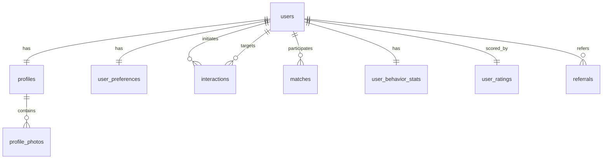

# Схема базы данных (PostgreSQL)

Нормализованное хранилище для пользователей, профилей, предпочтений, взаимодействий, мэтчей, поведенческих агрегатов, рейтингов и рефералов. Миграции управляются через [golang-migrate](https://github.com/golang-migrate/migrate).

## ER-диаграмма (обзор)

## Таблицы

### `users`

Таблица идентификации, одна строка на Telegram-аккаунт. Минимальная — все "дейтинговые" данные живут в `profiles`.

| Столбец              | Тип          | Примечания                              |
| -------------------- | ------------ | --------------------------------------- |
| `id`                 | BIGSERIAL    | PK                                      |
| `telegram_id`        | BIGINT       | UNIQUE, NOT NULL                        |
| `telegram_username`  | TEXT         | Nullable; `@handle` без `@`             |
| `registered_at`      | TIMESTAMPTZ  | NOT NULL, default `now()`               |
| `is_active`          | BOOLEAN      | NOT NULL, default `true`                |
| `referral_code`      | TEXT         | UNIQUE, человекочитаемый (напр. 8 символов) |
| `referred_by_user_id`| BIGINT       | FK → `users(id)`, nullable              |

**Индексы:** `UNIQUE(telegram_id)`, `UNIQUE(referral_code)`.

### `profiles`

Одна строка на пользователя (1:1). Фильтры discovery используют эти столбцы.

| Столбец             | Тип               | Примечания                                         |
| ------------------- | ----------------- | -------------------------------------------------- |
| `user_id`           | BIGINT            | PK, FK → `users(id)` ON DELETE CASCADE             |
| `name`              | TEXT              | Отображаемое имя                                   |
| `bio`               | TEXT              | Nullable                                           |
| `age`               | SMALLINT          | Вычисляется из `birth_date` или вводится напрямую  |
| `birth_date`        | DATE              | Nullable; предпочтительнее голого возраста          |
| `gender`            | TEXT              | `male`, `female`, `other`                          |
| `city`              | TEXT              | Для отображения / фильтрации                       |
| `latitude`          | DOUBLE PRECISION  | Nullable                                           |
| `longitude`         | DOUBLE PRECISION  | Nullable                                           |
| `interests`         | JSONB             | Массив строк, напр. `["music", "travel"]`          |
| `completeness_score`| REAL              | 0.0–1.0, обновляется Profile service при записи    |
| `updated_at`        | TIMESTAMPTZ       | NOT NULL, default `now()`                          |

**Индексы:** `(city)`, `(gender)`, `(age)`. Рассмотреть PostGIS GiST-индекс на `(latitude, longitude)` при необходимости гео-фильтрации.

**Формула completeness:**
- Есть имя: +0.10
- Есть bio: +0.15
- Есть 3+ фото: +0.25
- Установлены предпочтения: +0.20
- Указана локация: +0.15
- Указаны интересы: +0.15
- Итого: 1.0

### `profile_photos`

| Столбец      | Тип         | Примечания                                    |
| ------------ | ----------- | --------------------------------------------- |
| `id`         | BIGSERIAL   | PK                                            |
| `profile_id` | BIGINT     | FK → `profiles(user_id)` ON DELETE CASCADE    |
| `s3_key`     | TEXT        | NOT NULL, ключ объекта в MinIO                |
| `sort_order` | INT         | NOT NULL, default 0                           |
| `is_primary` | BOOLEAN     | default `false`                               |
| `uploaded_at`| TIMESTAMPTZ | NOT NULL, default `now()`                     |

**Индексы:** `(profile_id, sort_order)`.

### `user_preferences`

| Столбец             | Тип         | Примечания                                         |
| ------------------- | ----------- | -------------------------------------------------- |
| `user_id`           | BIGINT      | PK, FK → `users(id)` ON DELETE CASCADE             |
| `pref_age_min`      | SMALLINT    | Nullable                                           |
| `pref_age_max`      | SMALLINT    | Nullable                                           |
| `pref_gender`       | TEXT[]      | Массив, напр. `{male}` или `{male,female}`        |
| `pref_radius_km`    | INT         | Nullable; NULL = без ограничения по расстоянию     |
| `updated_at`        | TIMESTAMPTZ | NOT NULL, default `now()`                          |

Изменение предпочтений триггерит инвалидацию Redis discovery queue (DEL `discovery:queue:{user_id}`).

### `interactions`

Append-only лог событий. Каждый like/skip создаёт одну строку.

| Столбец             | Тип         | Примечания                                    |
| ------------------- | ----------- | --------------------------------------------- |
| `id`                | BIGSERIAL   | PK                                            |
| `actor_user_id`     | BIGINT      | FK → `users(id)`                              |
| `target_user_id`    | BIGINT      | FK → `users(id)`                              |
| `action_type`       | TEXT        | `like` или `skip` (рассмотреть ENUM)          |
| `created_at`        | TIMESTAMPTZ | NOT NULL, default `now()`                     |

**Индексы:** `(actor_user_id, created_at DESC)`, `(target_user_id, action_type)` для агрегатных запросов, `UNIQUE(actor_user_id, target_user_id)` если допускается максимум одно взаимодействие на пару.

### `matches`

Одна строка на пару взаимных лайков. **Каноничный порядок:** всегда `user_a_id = LEAST(a, b)`, `user_b_id = GREATEST(a, b)`, чтобы `(A,B)` и `(B,A)` отображались в одну строку.

| Столбец                 | Тип         | Примечания                                          |
| ----------------------- | ----------- | --------------------------------------------------- |
| `id`                    | BIGSERIAL   | PK                                                  |
| `user_a_id`             | BIGINT      | FK → `users(id)`; меньший ID                        |
| `user_b_id`             | BIGINT      | FK → `users(id)`; больший ID                        |
| `matched_at`            | TIMESTAMPTZ | NOT NULL, default `now()`                           |
| `conversation_started`  | BOOLEAN     | default `false`                                     |
| `conversation_started_at`| TIMESTAMPTZ| Nullable                                            |

**Индексы:** `UNIQUE(user_a_id, user_b_id)`, `(user_a_id)`, `(user_b_id)`.

### `user_behavior_stats`

Агрегаты, поддерживаемые RabbitMQ consumer'ом Ranking service. Опционально сверяются через запланированную задачу asynq.

| Столбец              | Тип               | Примечания                                     |
| -------------------- | ----------------- | ---------------------------------------------- |
| `user_id`            | BIGINT            | PK, FK → `users(id)`                          |
| `likes_received`     | INT               | default 0                                      |
| `skips_received`     | INT               | default 0                                      |
| `matches_count`      | INT               | default 0                                      |
| `conversations_started`| INT             | default 0                                      |
| `last_active_at`     | TIMESTAMPTZ       | Timestamp последнего взаимодействия             |
| `activity_histogram` | JSONB             | Бакеты активности по часам дня (0–23)           |
| `updated_at`         | TIMESTAMPTZ       | NOT NULL, default `now()`                      |

### `user_ratings`

Отдельная таблица для пересчитанных оценок (запланированная задача asynq). Отвязана от сырых данных, чтобы пересчёт не блокировал чтение.

| Столбец             | Тип               | Примечания                                      |
| ------------------- | ----------------- | ----------------------------------------------- |
| `user_id`           | BIGINT            | PK, FK → `users(id)`                           |
| `primary_score`     | DOUBLE PRECISION  | Уровень 1                                       |
| `behavioral_score`  | DOUBLE PRECISION  | Уровень 2                                       |
| `referral_bonus`    | DOUBLE PRECISION  | Бонус уровня 3                                  |
| `combined_score`    | DOUBLE PRECISION  | Итоговая взвешенная оценка                       |
| `breakdown`         | JSONB             | Опциональная детализация по компонентам          |
| `algorithm_version` | TEXT              | напр. `v1.0.0`                                  |
| `recalculated_at`   | TIMESTAMPTZ       | NOT NULL, default `now()`                       |

**Индексы:** `(combined_score DESC)` для ранжированных запросов.

**Формулы скоринга:**
- **L1 primary:** `0.4 × completeness + 0.3 × photo_score + 0.3 × pref_match`
- **L2 behavioral:** `0.3 × like_skip_ratio + 0.25 × match_rate + 0.25 × conv_rate + 0.2 × recency`
- **L3 combined:** `0.4 × L1 + 0.5 × L2 + 0.1 × referral_bonus`

Веса настраиваются через переменные окружения.

### `referrals`

Audit-лог реферальной системы.

| Столбец         | Тип               | Примечания                          |
| --------------- | ----------------- | ----------------------------------- |
| `id`            | BIGSERIAL         | PK                                  |
| `referrer_id`   | BIGINT            | FK → `users(id)`                   |
| `referred_id`   | BIGINT            | FK → `users(id)`                   |
| `created_at`    | TIMESTAMPTZ       | NOT NULL, default `now()`          |
| `bonus_applied` | DOUBLE PRECISION  | Баллы, начисленные реферреру        |

**Индексы:** `(referrer_id)`, `UNIQUE(referred_id)` (пользователь может быть приглашён только один раз).

## Связанные документы

- [services.md](services.md) — зоны ответственности сервисов.
- [architecture.md](architecture.md) — диаграмма системы, RabbitMQ routing, Redis keys, каталог событий.
